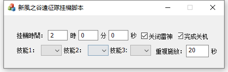

# 新楓之谷遠征隊挂機脚本使用方法
  
1. 設置挂機時長和施放的技能
2. 移動到遠征隊要挂機的地圖
3. 在游戲窗口中按CTRL+F1開啓脚本（脚本不支持後台，必須保持游戲窗口是置頂的）。脚本開啓后會在每個小時的01分和31分時施放設置的技能擊殺暗影。
4. 如果勾選了”关闭雷神“，那麽在設置的挂機時間結束后，脚本會暫停雷神加速器的加速時間。
5. 如果勾選了”完成关机“，在挂機時間結束后，會啓動60秒后关机的計劃任務(如果啓動后要关闭关机計劃可以打開電腦的命令提示符，並輸入”shutdown -a“取消該關機任務)。
# 其他
1. 如果你喜歡這個脚本，你可以點一下右上角的星星支持這個脚本。
2. 該脚本使用win32 api 消息機制實現，如果你知道有可以后台控制游戲窗口的方法，請留言，十分感謝！！！