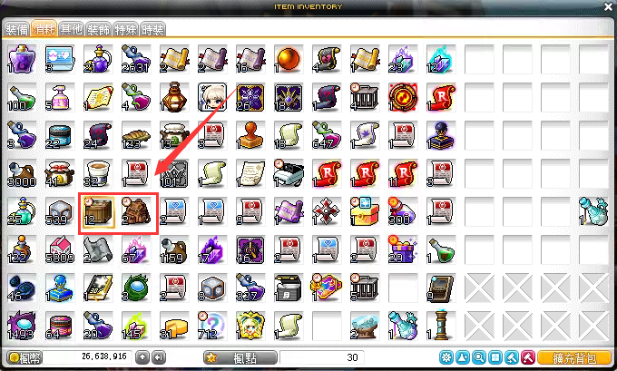

# 说明
一个用于新枫之谷远征队挂机的脚本，在整点半点的时候施放技能消灭影子，在挂机完成后关闭计算机。
# 编译工具
Visual Studio 2015
# 新枫之谷远征队挂机脚本使用方法
  
1. 设置挂机时长和施放的技能
2. 移动到远征队要挂机的地图
3. 在游戏窗口中按CTRL+F1开启脚本（脚本不支持后台，必须保持游戏窗口是置顶的）。脚本开启后会在每个小时的0分和30分(+5秒)时施放设置的技能击杀暗影。
4. 如果勾选了”关闭雷神“，那么在设置的挂机时间结束后，脚本会暂停雷神加速器的加速时间。
5. 如果勾选了”完成关机“，在挂机时间结束后，会启动60秒后关机的计划任务(如果启动后要关闭关机计划可以打开电脑的命令提示符，并输入”shutdown -a“取消该关机任务)。
6. 在设置的挂机时间结束后就可以回来看看自己的挂机收获了。
  
# 其他
1. 如果你喜欢这个脚本，你可以点一下右上角的星星支持这个脚本。
2. 该脚本使用win32 api 消息机制实现，如果你知道有可以后台控制游戏窗口的方法，请留言，十分感谢！！！